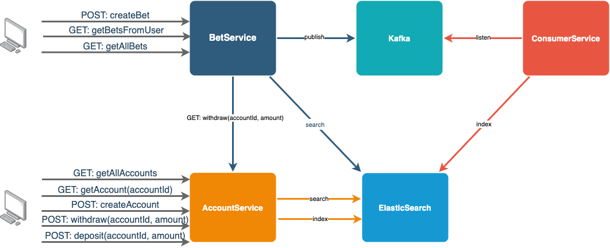

# Micro Betting System

Spring Boot microservices to exemplify Jaeger integration

# Architecture



# How to run

## 1. Run Jaeger All-In-One

```
docker run -d --name jaeger -e COLLECTOR_ZIPKIN_HTTP_PORT=9411 -p 5775:5775/udp -p 6831:6831/udp -p 6832:6832/udp -p 5778:5778 -p 16686:16686 -p 14268:14268 -p 14250:14250 -p 9411:9411 jaegertracing/all-in-one:1.22`
```

## 2. Run Elastic, Kafka and Zookeeper

Deploy [docker-compose.yml](infra/docker/docker-compose.yml):

```
docker-compose up
```

## 3. Run AccountService, BetService and ConsumerService

## 4. Postman

Postman collection available [here](tools/postman/MBS.postman_collection.json).
