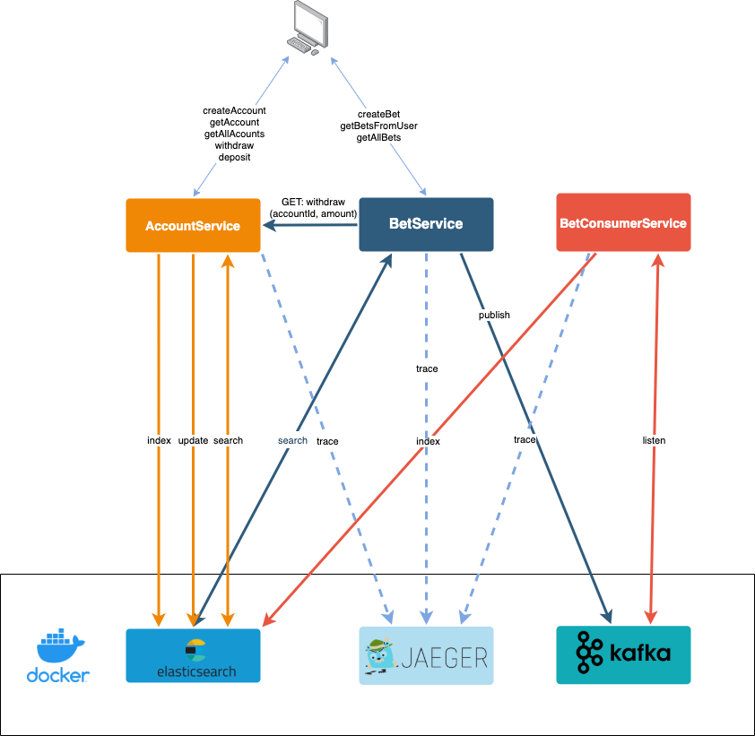

# Micro Betting System

Spring Boot microservices to exemplify Jaeger integration on a betting system

# Architecture



# How to run

## 1. Run Jaeger All-In-One, Elastic, Kafka and Zookeeper

Deploy [docker-compose.yml](infra/docker/docker-compose.yml):

```
docker-compose up
```

Jaeger UI is available at [http://127.0.0.1:16686/](http://127.0.0.1:16686/)

## 2. Run AccountService, BetService and ConsumerService

## 3. REST API

Swagger UI:
 - [BetService](http://127.0.0.1:8081/swagger-ui/index.html)
 - [AccountService](http://127.0.0.1:8082/swagger-ui.html)

Postman collection available [here](tools/postman/MBS.postman_collection.json).
